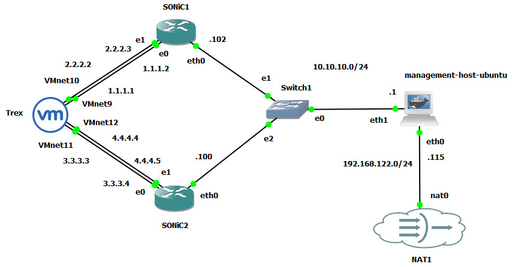
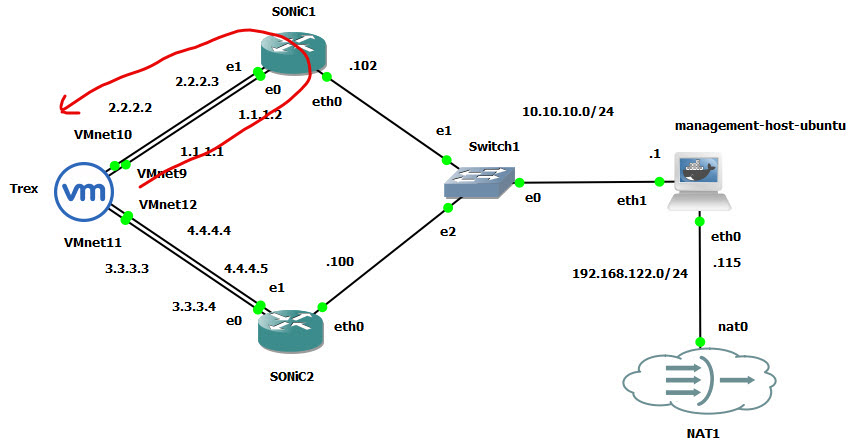

# GNS-Sonic-Traffic

The GNS-Sonic-Traffic project is an extension of the [GNS-Bench](https://github.com/ManiAm/GNS-Bench) project, specifically designed to simulate traffic flows across SONiC-based routers within a virtualized GNS3 environment using Cisco TRex. This setup enables controlled generation and analysis of traffic, allowing users to validate forwarding behavior, interface counters, and network path visibility across SONiC devices.



## TRex

[Cisco TRex](https://trex-tgn.cisco.com/) is a traffic generator designed for high-performance testing of networking devices. It operates in two primary modes: stateless and stateful.

- In **stateless** mode, TRex replays pre-captured packet streams (e.g., PCAP files) at configurable rates without maintaining any connection or session state. This mode is optimized for L2-L4 traffic generation and is ideal for load testing network devices such as routers, switches, and stateless firewalls.

- In **stateful** mode, TRex emulates full client-server communication at L4-L7. It supports realistic application-level interactions, including TCP handshakes, session management, and protocols such as HTTP and DNS. This mode is used to test complex features like deep packet inspection (DPI), NAT, and stateful firewall behavior.

While stateless mode offers high performance and scalability, stateful mode provides more realism by simulating end-to-end application flows.

**TRex Setup**

For best compatibility, Cisco recommends CentOS 7.6 (64-bit). [This guide](./README_TREX.md) walks you through installing CentOS in VMware, configuring network interfaces, installing TRex, and preparing it for GNS3 integration.

To connect the CentOS virtual machine to your GNS3 topology, add a "Cloud" node to the workspace, right-click it, and select "Configure". In the configuration window, enable the "Show special Ethernet interfaces" option to display all available VMware virtual adapters. Then add the newly created Host-Only VMnet interfaces (e.g., VMnet9-VMnet12) from the VMware Virtual Network Editor. This allows the CentOS VM to participate in the GNS3 topology and communicate with other simulated network devices over isolated virtual networks.

## SONiC Interface Configuration

Open a console session to sonic1 and assign static IP addresses to Ethernet0 and Ethernet4. To persist these changes across reboots, save the configuration.

    admin@sonic:~$ sudo config interface ip add Ethernet0 1.1.1.2/24
    admin@sonic:~$ sudo config interface ip add Ethernet4 2.2.2.3/24
    admin@sonic:~$ sudo config save -y

Verify interface assignments:

    admin@sonic:~$ show ip interfaces

    Interface    Master    IPv4 address/mask    Admin/Oper    BGP Neighbor    Neighbor IP
    -----------  --------  -------------------  ------------  --------------  -------------
    Ethernet0              1.1.1.2/24           up/up         N/A             N/A
    Ethernet4              2.2.2.3/24           up/up         N/A             N/A

Open a console session to sonic2 and repeat the configuration with different IPs:

    admin@sonic:~$ sudo config interface ip add Ethernet0 3.3.3.4/24
    admin@sonic:~$ sudo config interface ip add Ethernet4 4.4.4.5/24
    admin@sonic:~$ admin@sonic:~$ sudo config save -y

Verify interface assignments:

    admin@sonic:~$ show ip interfaces

    Interface    Master    IPv4 address/mask    Admin/Oper    BGP Neighbor    Neighbor IP
    -----------  --------  -------------------  ------------  --------------  -------------
    Ethernet0              3.3.3.4/24           up/up         N/A             N/A
    Ethernet4              4.4.4.5/24           up/up         N/A             N/A

**Understand Interface Naming and Mapping**

Sonic uses platform-specific configuration files to define port mappings. You can locate this file in here:

    cat /usr/share/sonic/device/<platform>/<HwSKU>/port_config.ini

To determine your `<platform>` and `<HwSKU>`, run:

    admin@sonic:~$ show version

    <snip>
    Platform: x86_64-kvm_x86_64-r0
    HwSKU: Force10-S6000
    <snip>

This mapping defines how logical interfaces correspond to hardware lanes and physical ports. In many cases, ports increment by 4 (Ethernet0, Ethernet4, Ethernet8, ...) due to 4-lane breakout configurations for high-speed ports. Check actual port mapping and operational status:

    admin@sonic:~$ show interfaces status

    Interface            Lanes    Speed    MTU    FEC           Alias    Vlan    Oper    Admin    Type    Asym PFC
    -----------  ---------------  -------  -----  -----  --------------  ------  ------  -------  ------  ----------
    Ethernet0      25,26,27,28       1G   9100    N/A    fortyGigE0/0  routed      up       up     N/A         N/A
    Ethernet4      29,30,31,32       1G   9100    N/A    fortyGigE0/4  routed      up       up     N/A         N/A
    Ethernet8      33,34,35,36      40G   9100    N/A    fortyGigE0/8  routed    down       up     N/A         N/A
    Ethernet12      37,38,39,40      40G   9100    N/A   fortyGigE0/12  routed    down       up     N/A         N/A
    Ethernet16      45,46,47,48      40G   9100    N/A   fortyGigE0/16  routed    down       up     N/A         N/A
    Ethernet20      41,42,43,44      40G   9100    N/A   fortyGigE0/20  routed    down       up     N/A         N/A

GNS3 assigns interface names like e0, e1, etc., based on the order of virtual NICs presented to the VM. These may not directly map to Sonic's EthernetX names. For example, e0 corresponds to Ethernet0, e1 to Ethernet4, and so on.

## Verify Connectivity

At this stage, the TRex interfaces have not yet been bound to the DPDK driver. This means they are still managed by the Linux kernel, allowing standard IP networking tools such as ping to function.

From Sonic1 you should be able to ping both interfaces of Trex.

    admin@sonic:~$ ping 2.2.2.2

    PING 2.2.2.2 (2.2.2.2) 56(84) bytes of data.
    64 bytes from 2.2.2.2: icmp_seq=1 ttl=64 time=1.66 ms
    64 bytes from 2.2.2.2: icmp_seq=2 ttl=64 time=2.59 ms

    --- 2.2.2.2 ping statistics ---
    2 packets transmitted, 2 received, 0% packet loss, time 1001ms
    rtt min/avg/max/mdev = 1.656/2.123/2.591/0.467 ms

And also:

    admin@sonic:~$ ping 1.1.1.1

    PING 1.1.1.1 (1.1.1.1) 56(84) bytes of data.
    64 bytes from 1.1.1.1: icmp_seq=1 ttl=64 time=2.39 ms
    64 bytes from 1.1.1.1: icmp_seq=2 ttl=64 time=1.98 ms

You should also verify that TRex can ping `1.1.1.2` and `2.2.2.3`, confirming bidirectional reachability.

Once TRex binds its interfaces to the DPDK driver, the Linux kernel will no longer manage those interfaces. As a result, they will no longer have IP addresses or respond to ICMP echo requests (ping). This is expected behavior when DPDK takes full control of the interfaces for high-performance packet generation.

## TRex Traffic Generation

### Stateless Unidirectional Flow Test

In this scenario, we configure TRex to send unidirectional UDP traffic from TRex port 0 (connected to VMnet9) to a remote device (sonic1) and receive responses on TRex port 1 (connected to VMnet10).



To launch the traffic test for 10 seconds:

    cd /opt/trex/v3.06
    sudo ./t-rex-64 -f cap2/simple_udp.yaml -d 10

Here is a sample output:

```text
-Per port stats table
      ports |               0 |               1
 -----------------------------------------------------------------------------------------
   opackets |              98 |               0
     obytes |            6272 |               0
   ipackets |               0 |              88
     ibytes |               0 |            5632
    ierrors |               0 |               0
    oerrors |               0 |               0
      Tx Bw |       5.09 Kbps |       0.00  bps

-Global stats enabled
 Cpu Utilization : 0.2  %  0.0 Gb/core
 Platform_factor : 1.0
 Total-Tx        :       5.09 Kbps
 Total-Rx        :       3.21 Kbps
 Total-PPS       :       9.93  pps
 Total-CPS       :       0.00  cps

 Expected-PPS    :      10.00  pps
 Expected-CPS    :      10.00  cps
 Expected-BPS    :       5.12 Kbps

 Active-flows    :        1  Clients :        1   Socket-util : 0.0016 %
 Open-flows      :        1  Servers :        1   Socket :        1 Socket/Clients :  1.0
 drop-rate       :       1.88 Kbps
 current time    : 11.3 sec
 test duration   : 0.0 sec
```

In the per port stats table, TRex shows two ports (port 0 and port 1) which correspond to the DPDK-bound interfaces (e.g., `ens34`, `ens35`). Traffic is transmitted on port 0 and received back on port 1. After running a TRex traffic test, you can review overall transmission and reception statistics in the summary section of the output:

```text
summary stats
 --------------
 Total-pkt-drop       : 7 pkts
 Total-tx-bytes       : 6528 bytes
 Total-tx-sw-bytes    : 0 bytes
 Total-rx-bytes       : 6248 byte

 Total-tx-pkt         : 102 pkts
 Total-rx-pkt         : 95 pkts
 Total-sw-tx-pkt      : 0 pkts
 Total-sw-err         : 0 pkts
 Total ARP sent       : 4 pkts
 Total ARP received   : 2 pkts
```

**Traffic Profile**

The traffic profile (`simple_udp.yaml`) is defined as follows:

```yaml
- duration: 5

  generator:
    distribution: seq
    clients_start: 1.1.1.1
    clients_end: 1.1.1.1
    servers_start: 2.2.2.2
    servers_end: 2.2.2.2
    clients_per_gb: 1
    min_clients: 1
    dual_port_mask: 0.0.0.0
    tcp_aging: 0
    udp_aging: 0

  cap_info:
    - name: cap2/udp_64B.pcap
      cps: 10
      limit: 1
      ipg: 100
      rtt: 10000
      w: 1
```

This configuration instructs TRex to send traffic with a source IP of 1.1.1.1 and a destination IP of 2.2.2.2. The `dual_port_mask` parameter determines which TRex port is used to transmit traffic, calculated by:

    (client_ip & dual_port_mask) % NUM_PORTS

Since the `dual_port_mask` is set to 0.0.0.0, all traffic is sent from port 0.

The `udp_64B.pcap` file serves as the traffic template. Opening it in Wireshark shows it contains a single 64-byte UDP frame. TRex uses this frame to generate synthetic traffic by replicating and modifying it based on the configured parameters.

**Traffic Generation Parameters**

| Field   | Description                                                                  |
|---------|------------------------------------------------------------------------------|
| cps     | Connections per second - number of flows to initiate every second.           |
| limit   | Number of packets to send per flow (taken from the pcap file).               |
| ipg     | Inter-packet gap (in microseconds) - delay between packets in a single flow. |
| rtt     | Simulated round-trip time (in microseconds) - used for flow pacing.          |
| w       | Weight of the flow - relative importance if multiple flows are used.         |

In this example, we set `cps: 10`, which means TRex will create 10 new flows every second. Each flow will send only one packet, as defined by `limit: 1`, making the total packet rate 10 packets per second. Although we set `ipg: 100`, which normally introduces a 100 microsecond delay between packets within a flow, it has no effect here because there is only one packet per flow. The `rtt: 10000` setting simulates a 10 millisecond round-trip time between the client and server, which helps TRex pace the flows more realistically, even though in this case each flow is extremely short. This setup is ideal for generating controlled, low-rate UDP traffic for basic functionality or performance testing.

**Monitoring Traffic on the SONiC Side**

To verify traffic on the Sonic device, first clear interface counters to ensure clean measurements:

    sonic-clear counters

Then run your TRex traffic test, and afterward display the updated counters:

    show interfaces counters

Here is an example:

        IFACE    STATE    RX_OK     RX_BPS    RX_UTIL    RX_ERR    RX_DRP    RX_OVR    TX_OK     TX_BPS    TX_UTIL    TX_ERR    TX_DRP    TX_OVR
    -----------  -------  -------  ---------  ---------  --------  --------  --------  -------  ---------  ---------  --------  --------  --------
    Ethernet0        U      104  57.95 B/s      0.00%         0         0         0       14  31.67 B/s      0.00%         0         0         0
    Ethernet4        U        2   0.33 B/s      0.00%         0         0         0       94  43.51 B/s      0.00%         0         0         0
    Ethernet8        D        0   0.00 B/s      0.00%         0         0         0       62   8.95 B/s      0.00%         0         0         0
    Ethernet12       D        0   0.00 B/s      0.00%         0         0         0       62   8.96 B/s      0.00%         0         0         0
    Ethernet16       D        0   0.00 B/s      0.00%         0         0         0       62   8.96 B/s      0.00%         0         0         0
    Ethernet20       D        0   0.00 B/s      0.00%         0         0         0       62   8.96 B/s      0.00%         0         0         0

In this example:

- `RX_OK` on Ethernet0 indicates successful reception of packets.
- `TX_OK` on Ethernet4 shows successful transmission of packets.

These counters can be correlated with TRex statistics to validate end-to-end connectivity and detect any drops or inconsistencies

### Stateless Bidirectional Flow

TODO

