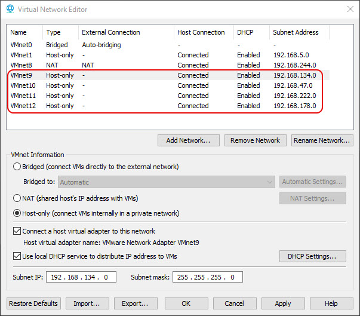

# TRex on CentOS 7

In this setup, we will create a CentOS 7 virtual machine using VMware Workstation and install TRex. VMware Workstation is used here for convenience and ease of integration with host-only networks, but you may use any other hypervisor as long as it provides support for multiple network interfaces and allows DPDK-compatible NICs. The CentOS 7 VM will serve as the TRex host, simulating network traffic between its virtual interfaces and other nodes in our GNS3 topology.

## VMware Virtual Network

Open "VMware Virtual Network Editor" and create four additional virtual networks in host-only mode, as highlighted in the image below.

These host-only networks allow isolated communication between the host and virtual machines, without external network access. Each network is assigned a unique subnet, and by default, the VMware DHCP service is enabled to automatically assign IP addresses to connected VMs. However, DHCP functionality is not required for this setup. You may choose to disable the DHCP service for each VMnet, or leave it enabled.

## Download and Install CentOS 7.6

Navigate to the following website, and download "CentOS-7-x86_64-DVD-1810.iso" image.

    http://vault.centos.org/7.6.1810/isos/x86_64/

Create a new VM in VMware Workstation and use the downloaded ISO. Set vCPUs to 4 and increase RAM to 2 GB. Add 4 more network interfaces and connect each to one of the virtual networks that we created earlier (e.g., VMnet9-VMnet12).

VMware "Easy Install" will automatically complete the OS setup.

Login to CentOS and verify the network interfaces:

    ifconfig

    ens33: flags=4163<UP,BROADCAST,RUNNING,MULTICAST>  mtu 1500
            inet 192.168.244.131  netmask 255.255.255.0  broadcast 192.168.244.255
            inet6 fe80::6528:ac05:4cf2:8183  prefixlen 64  scopeid 0x20<link>
            ether 00:0c:29:b4:8f:e1  txqueuelen 1000  (Ethernet)
            RX packets 1325  bytes 1834910 (1.7 MiB)
            RX errors 0  dropped 0  overruns 0  frame 0
            TX packets 647  bytes 45274 (44.2 KiB)
            TX errors 0  dropped 0 overruns 0  carrier 0  collisions 0

    ens34: flags=4163<UP,BROADCAST,RUNNING,MULTICAST>  mtu 1500
            ether 00:0c:29:b4:8f:eb  txqueuelen 1000  (Ethernet)
            RX packets 30  bytes 2366 (2.3 KiB)
            RX errors 0  dropped 0  overruns 0  frame 0
            TX packets 0  bytes 0 (0.0 B)
            TX errors 0  dropped 0 overruns 0  carrier 0  collisions 0

    ens35: flags=4163<UP,BROADCAST,RUNNING,MULTICAST>  mtu 1500
            ether 00:0c:29:b4:8f:f5  txqueuelen 1000  (Ethernet)
            RX packets 30  bytes 2366 (2.3 KiB)
            RX errors 0  dropped 0  overruns 0  frame 0
            TX packets 0  bytes 0 (0.0 B)
            TX errors 0  dropped 0 overruns 0  carrier 0  collisions 0

    ens36: flags=4163<UP,BROADCAST,RUNNING,MULTICAST>  mtu 1500
            ether 00:0c:29:b4:8f:ff  txqueuelen 1000  (Ethernet)
            RX packets 30  bytes 2366 (2.3 KiB)
            RX errors 0  dropped 0  overruns 0  frame 0
            TX packets 0  bytes 0 (0.0 B)
            TX errors 0  dropped 0 overruns 0  carrier 0  collisions 0

    ens37: flags=4163<UP,BROADCAST,RUNNING,MULTICAST>  mtu 1500
            ether 00:0c:29:b4:8f:09  txqueuelen 1000  (Ethernet)
            RX packets 30  bytes 2366 (2.3 KiB)
            RX errors 0  dropped 0  overruns 0  frame 0
            TX packets 0  bytes 0 (0.0 B)
            TX errors 0  dropped 0 overruns 0  carrier 0  collisions 0

`ens33` is your management interface and can be used to connect to this VM. The rest of the interfaces can be used by TRex. To test connectivity, go to the CentOS network settings and manually assign static IP addresses to each of the network interfaces (ens34 to ens37).

| Interface | Assigned IP | Netmask          |
|-----------|-------------|------------------|
| ens34     | 1.1.1.1     | 255.255.255.0    |
| ens35     | 2.2.2.2     | 255.255.255.0    |
| ens36     | 3.3.3.3     | 255.255.255.0    |
| ens37     | 4.4.4.4     | 255.255.255.0    |

## Enable Sudo Access and Fix Repositories

Grant sudo access to your username:

    su -
    usermod -aG wheel <username>

Log out and back in for group changes to apply.

CentOS 7 is EOL, so mirror links may be broken. Run the following script to fix them:

    sudo bash -c "$(wget -qO- https://raw.githubusercontent.com/AtlasGondal/centos7-eol-repo-fix/main/centos7_eol_fix.sh)"

## Install Required Packages

Install these packages:

    sudo yum install -y python3

## Enable HugePages

TRex is built on top of DPDK, which relies on hugepages to improve memory access performance and reduce CPU overhead. Hugepages allow DPDK to allocate large, contiguous blocks of memory, minimizing Translation Lookaside Buffer (TLB) misses and reducing the overhead of virtual-to-physical memory translation. This is critical for achieving high-throughput, low-latency packet processing, as it enables efficient DMA (Direct Memory Access) operations between user space and NIC hardware without frequent page table lookups.

Open the GRUB config file:

    sudo vi /etc/default/grub

Find the line starting with "GRUB_CMDLINE_LINUX", and append the following:

    default_hugepagesz=2M hugepagesz=2M hugepages=512

Update GRUB and reboot:

    sudo grub2-mkconfig -o /boot/grub2/grub.cfg
    sudo reboot

After reboot, verify:

    cat /proc/meminfo | grep HugePages

    onHugePages:     36864 kB
    HugePages_Total:     512
    HugePages_Free:      512
    HugePages_Rsvd:        0
    HugePages_Surp:        0

## Download and Install TRex

Create TRex directory and download latest TRex (or a specific version):

    sudo mkdir -p /opt/trex
    cd /opt/trex
    sudo wget --no-cache --no-check-certificate https://trex-tgn.cisco.com/trex/release/v3.06.tar.gz
    sudo tar -xzvf v3.06.tar.gz
    cd v3.06

Verify NICs visible to TRex:

    sudo ./dpdk_setup_ports.py -s

Here is an example output:

    Network devices using DPDK-compatible driver
    ============================================
    <none>

    Network devices using kernel driver
    ===================================
    0000:02:01.0 '82545EM Gigabit Ethernet Controller (Copper)' if=ens33 drv=e1000 unused=igb_uio,vfio-pci,uio_pci_generic
    0000:02:02.0 '82545EM Gigabit Ethernet Controller (Copper)' if=ens34 drv=e1000 unused=igb_uio,vfio-pci,uio_pci_generic
    0000:02:03.0 '82545EM Gigabit Ethernet Controller (Copper)' if=ens35 drv=e1000 unused=igb_uio,vfio-pci,uio_pci_generic
    0000:02:04.0 '82545EM Gigabit Ethernet Controller (Copper)' if=ens36 drv=e1000 unused=igb_uio,vfio-pci,uio_pci_generic
    0000:02:05.0 '82545EM Gigabit Ethernet Controller (Copper)' if=ens37 drv=e1000 unused=igb_uio,vfio-pci,uio_pci_generic

    Other network devices
    =====================
    <none>

In this example, all NICs are currently bound to the default kernel driver (`e1000`) and are not yet using a DPDK-compatible driver. The `unused=` field lists the available DPDK drivers that can be used to rebind these interfaces (e.g., `vfio-pci`, `igb_uio`, or `uio_pci_generic`).

You can also view detailed interface info:

    sudo ./dpdk_setup_ports.py -t

    +----+------+---------+-------------------+----------------------------------------------+--------+----------+--------+
    | ID | NUMA |   PCI   |        MAC        |                     Name                     | Driver | Linux IF | Active |
    +====+======+=========+===================+==============================================+========+==========+========+
    | 0  | -1   | 02:01.0 | 00:0c:29:b4:8f:e1 | 82545EM Gigabit Ethernet Controller (Copper) | e1000  | ens33    |        |
    +----+------+---------+-------------------+----------------------------------------------+--------+----------+--------+
    | 1  | -1   | 02:02.0 | 00:0c:29:b4:8f:eb | 82545EM Gigabit Ethernet Controller (Copper) | e1000  | ens34    |        |
    +----+------+---------+-------------------+----------------------------------------------+--------+----------+--------+
    | 2  | -1   | 02:03.0 | 00:0c:29:b4:8f:f5 | 82545EM Gigabit Ethernet Controller (Copper) | e1000  | ens35    |        |
    +----+------+---------+-------------------+----------------------------------------------+--------+----------+--------+
    | 3  | -1   | 02:04.0 | 00:0c:29:b4:8f:ff | 82545EM Gigabit Ethernet Controller (Copper) | e1000  | ens36    |        |
    +----+------+---------+-------------------+----------------------------------------------+--------+----------+--------+
    | 4  | -1   | 02:05.0 | 00:0c:29:b4:8f:09 | 82545EM Gigabit Ethernet Controller (Copper) | e1000  | ens37    |        |
    +----+------+---------+-------------------+----------------------------------------------+--------+----------+--------+

## Create TRex Configuration File

The TRex configuration file specifies all essential parameters required to initialize and operate TRex. This YAML-based file defines the DPDK-compatible PCI interfaces used for traffic generation, assigns internal IP addresses and default gateways to each port, and configures CPU threading for master control, latency measurements, and packet processing. To generate this file, TRex provides an interactive utility:

    sudo ./dpdk_setup_ports.py -i

This script detects DPDK-compatible NICs and guides you through configuring them. In our project, we select two interfaces (`ens34` and `ens35`). Each interface is assigned an internal IP address and a corresponding default gateway. These addresses are used exclusively by TRex for traffic simulation and ARP resolution. They are not used for external network communication.

| ID   | PCI      | Linux Name | IP Address | Default Gateway  |
|------|----------|------------|------------|------------------|
| 1    | 02:02.0  | ens34      | 1.1.1.1    | 1.1.1.2          |
| 2    | 02:03.0  | ens35      | 2.2.2.2    | 2.2.2.3          |

Once completed, the tool will prompt to save the configuration, typically to **/etc/trex_cfg.yaml**.
